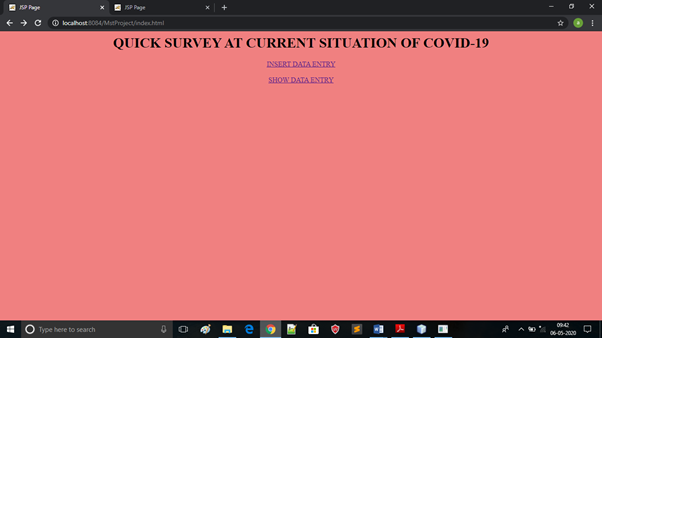
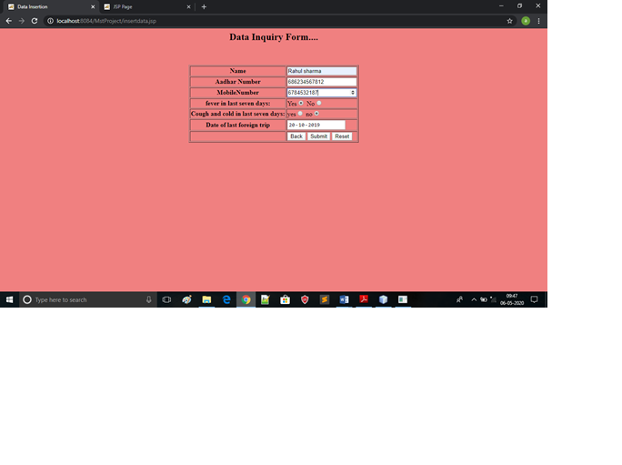
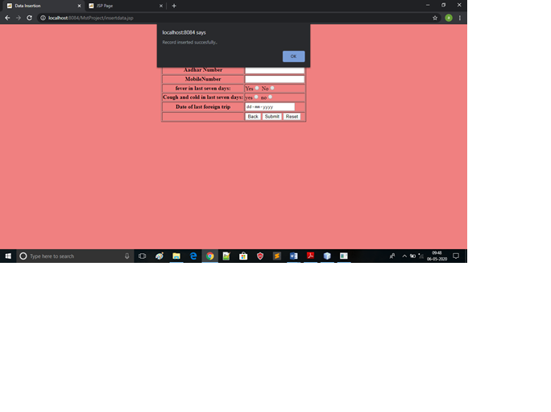
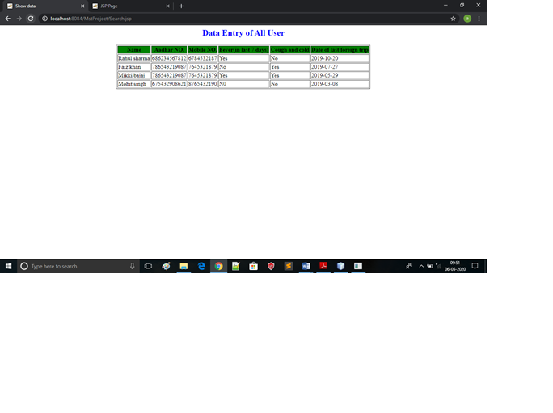
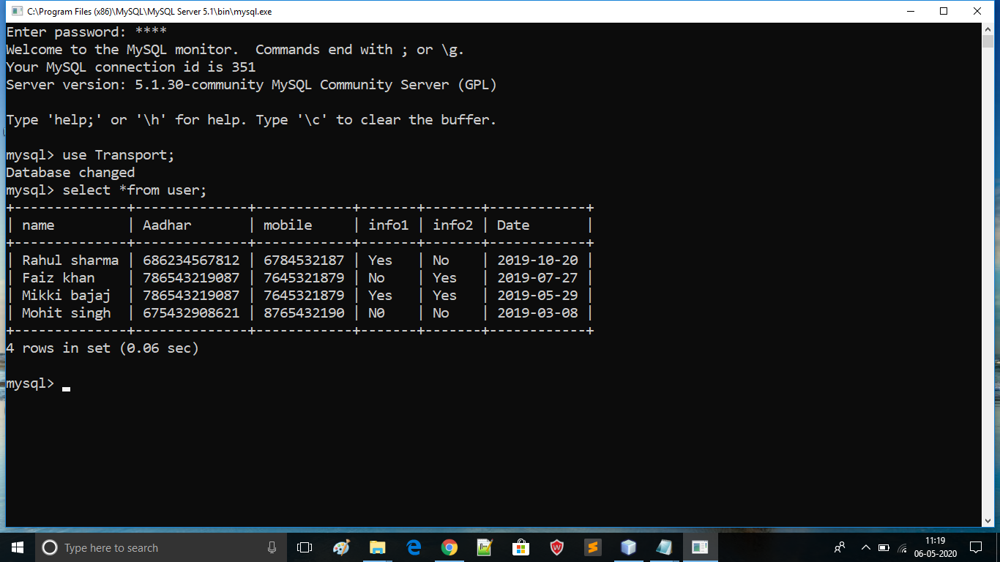

# MstProject
<b><u>Objective</b></u> 
A software which is develop to store survey information. 
<b>Users of system</b> 
<ul><li>Admin<li></ul>
<b>Functional Requirements</b> 
<ul><li>Admin</li>
1.	Can insert detail .  
2.	Can view user names.  
4.	Can view medical details .  
5.	Can view aadharno,mobile no .  
 
</ul>
<b>Tools Used</b> 
1.	javascript and jsp  
2.	Os:-Windows 10 
3.  Backend:-Mysql 
4.  Front End:-html and css  
5.  Database Connectivity:-JDBC 
   
<b>Working of Project with Screenshots</b> 
First page:-Step 1)first will design index page of project from project will start.there are two link “insert data entry”and “show data”  
 
Step 2)on click “insert data” a data entry page will open in which we insert all detail user(name,mobile,aadhar,medical detail(fever ,cough and cold): 
 
Step 3) we create database table in mysql named user to store all these information : 
Step 4)After creating database on click submit button.connection will stablish and Record inserted in database: 

 
Step 5) on click “show data entry” data will fetch from database and show all Record:
 
Record in Database(Mysql): 
 
